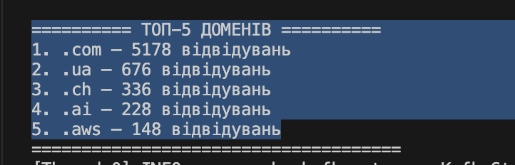

# Task 3

## How to Run

**1. Start Redpanda**
```bash
docker-compose up -d
docker exec redpanda rpk topic create browser-history --partitions 1 --replicas 1
```

**2. Build the Kafka Streams app**
```bash
mvn clean package
```

**3. Run Kafka Streams**
```bash
java -jar target/domain-stats-1.0-SNAPSHOT-jar-with-dependencies.jar
```

**4. Export browser history to CSV and run generator**
```bash
python generator.py history.csv
```

**5. Press Ctrl+C in Terminal 1 to see top 5 domains**

## Results


